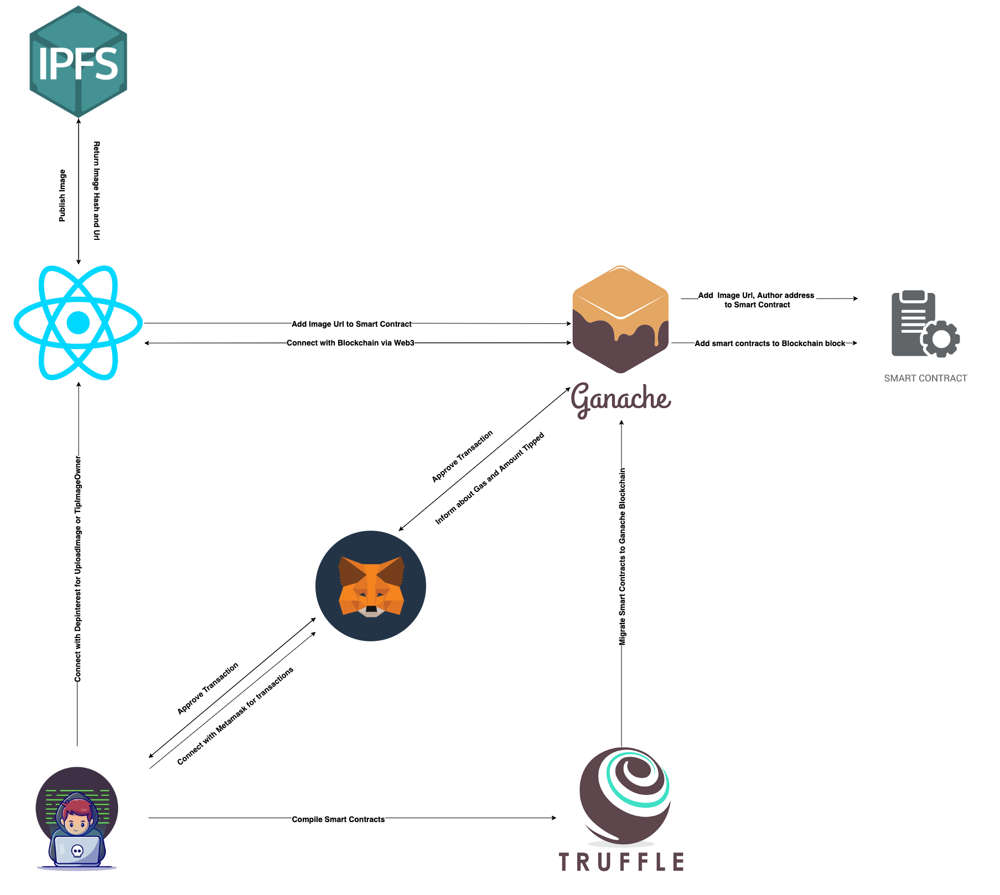
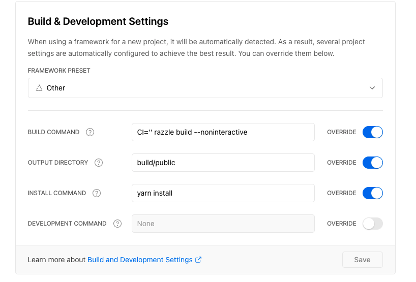

# Decentralized Pinterest


### [Website](https://depinterest.vercel.app/)

[Deployed contract](https://ropsten.etherscan.io/address/0x0ecf210b6c62F790160bA346589267a6314aAE6b)

## Table of Contents
- [About the Project](#about-the-project)
    - [Use cases](#use-cases)
    - [Architecture](#architecture)
- [Directory Structure](#directory-structure)
- [Installation](#installation)
    - [Prerequisites](#prerequisites)
    - [Smart Contracts](#smart-contracts)
    - [Frontend](#frontend)
    - [Local development](#local-development)
- [Deployment](#deployment)
    - [Smart Contract](#smart-contract)
    - [Web App](#web-app)
- [Screencast link](#screencast-link)
- [Public Ethereum wallet for certification](#public-ethereum-wallet-for-certification)
- [Happy Path User flow](#happy-path-user-flow)
- [Documentation](#documentation)
- [Environment variables](#environment-variables)
- [TODO Features](#todo-features)

## About the Project
My idea for blockchain bootcamp is to create a decentralized pinterest where people can share images. People can also like images shared by others. This action transfers some amount of cryptocurrency (0.01 ETH) to the author of the image being liked.
The idea is to move away from Pinterest having central authority over the platform. This ensures decentralized uploading of images
and allows people to appreciate art by tipping the author of the image. 

### Use cases :
- Users should be able to upload image
- Users should be able to scroll through their feed and see all the images uploaded across the globe
- Users should be able to tip any image they like with 0.01 ETH
- User is shown tip confirmation with some level of determinis


### Architecture:
- Local blockchain development : [Ganache](https://www.trufflesuite.com/ganache)
- Smart contracts development : [Truffle](https://www.trufflesuite.com/truffle)
- Decentralized File Storage : [IPFS](https://ipfs.io/)
- Frontend library : [React](https://reactjs.org/)
- Interaction with Ehtereum node : [Web3.js](https://web3js.readthedocs.io/en/v1.5.2/#)
- Crypto wallet for transactions : [Metamask](https://metamask.io/)




## Directory Structure
The project was bootstrapped from [Razzle](https://razzlejs.org/getting-started). The `client/` folder contains the React frontend app, everything outside of this folder contains the smart contract code. Note, that the smart contract code has its own `package.json` and `node_modules/` for the smart contract's dependencies (which are different from the ones inside of `client/`). There is also a `docs/` folder with the generated documentation (see more in the Documentation section). `test/` folder contain's smart contract's tests. 
- `client`: Project's React frontend.
- `contracts`: Smart contracts that are deployed in the Ropsten testnet.
- `migrations`: Migration files for deploying contracts in `contracts` directory.
- `test`: Tests for smart contracts.


## Installation

### Prerequisites

- Install [Node.js >= v14](https://nodejs.org/en/download/)
- Install [Truffle](https://www.trufflesuite.com/docs/truffle/getting-started/installation) and [Ganache](https://www.trufflesuite.com/ganache)
- Yarn
- `git checkout main`
- Install [MetaMask](https://metamask.io/) extension in your browser

### Smart Contracts

- Run `yarn install` in project root to install Truffle build and smart contract dependencies
- Run local testnet in port `7545` with an Ethereum client, e.g. Ganache
- `truffle migrate --network development`
- `truffle console --network development`
- Run tests in Truffle console: `test`
- `development` network id is 1337, remember to change it in Metamask as well!

### Frontend

- `cd client`
- `yarn install`
- `yarn start`
- Open `http://localhost:3000`

### Local development

- `truffle migrate --network development`
- `truffle console --network development`
- `let dp = await Depinterest.deployed()`
- Add two images:
- `dp.uploadImage("https://images.hdqwalls.com/wallpapers/doge-to-the-moon-05.jpg", "Doge coin is the best. Wohhooo!")`
- `dp.uploadImage("https://themarketperiodical.com/wp-content/uploads/2021/08/s2-3.jpg", "Solana is the future folks.")`
- Send ETH to local wallet: `web3.eth.sendTransaction({ from: "<your local address>", to: "<your local network wallet>", value: web3.utils.toWei("10") })`
- `cd client && yarn start`
- Open local ui from `http://localhost:3000`
- Make sure your Metamask localhost network is in port `7545` and chain id is `1337`.
- If you get `TXRejectedError` when sending a transaction, reset your Metamask account from Advanced settings.

## Deployment
The web app (everyting inside the `client/`) folder and the smart contract (everyting EXCEPT the `client/` folder are deployed separately). 

### Smart Contract
We will deploy the smart contract to Ropsten Network using [Infura](https://infura.io/). 
- Create an `.env` file inside `blockchain-developer-bootcamp-final-project`. 
- Copy the contents of `.env.sample` to `.env` 
- Pick an address that is going to deploy the contract (and make sure that address has funds) and fill out its mnemonic in the `ROPSTEN_MNEMONIC` variable in the .env file. 
- Create an Infura account - follow [these](https://blog.infura.io/getting-started-with-infura-28e41844cc89/) directions up to and including Step 2.
- Copy the PROJECT_ID generated on Infura dashboard and add to the .env file in the `ROPSTEN_INFURA_PROJECT_ID`  variable.
- Run `truffle migrate --network ropsten` 

**DO NOT SHARE YOUR INFURA URL OR MNEMONIC OR COMMIT THEM TO VERSION CONTROL!**

### Web App
- Create a [Vercel](https://vercel.com/) account if you don't have one. 
- Setup you project by following these [steps](https://vercel.com/docs/get-started). 
- Connect this github repo to the pipeline.
- Make sure you have the following `Build and Deployment Settings` in your Project Settings on Vercel

- Trigger deployment by selecting the branch `main`

## Screencast link
[Youtube Link](https://www.youtube.com/watch?v=emnChd3ZPpI)

## Public Ethereum wallet for certification

`0x9fd84217708c3360F50372533f57B35Aaa2B9606`


## Happy Path User flow

1. Enter the website
2. Login with Metamask
3. Browse the images
4. Select an image
5. Pay a tip to the image author with Metamask (smart contract call) as a token of appreciation.
6. The tip is successful after there are 2 Block confirmations added to the chain as a guard rail.

## Documentation
Run this command to generate the documntaion for the smart contract. The generated \*.md files wil appear in the `docs/` folder. 
```
npx solidity-docgen --solc-module solc-0.8 
```

## Environment variables 
These are not needed for local development
```
ROPSTEN_INFURA_PROJECT_ID=
ROPSTEN_MNEMONIC=
```

## TODO features

- Fund withdrawal
- Custom tipping
